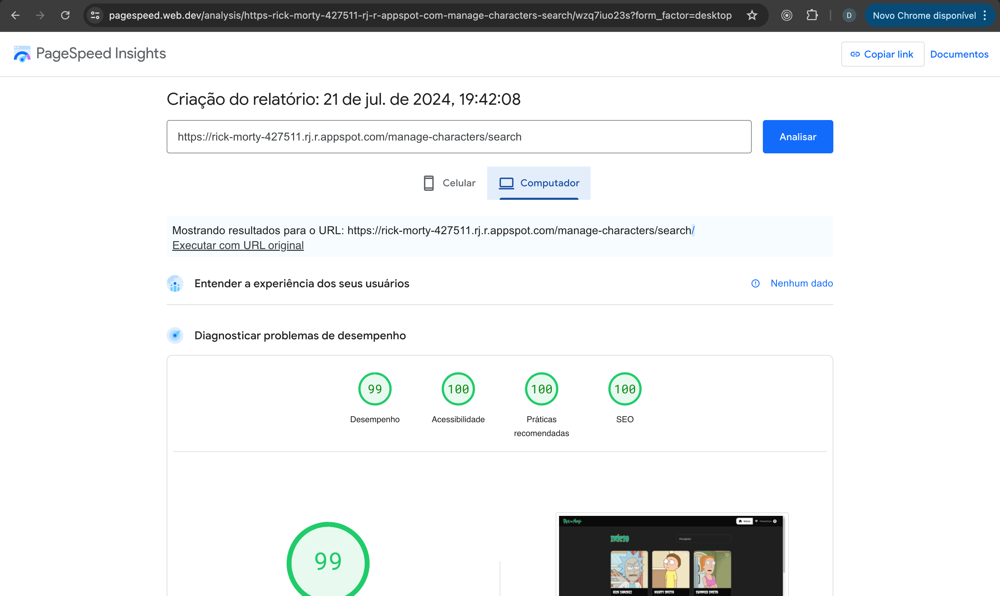

# Toon Galaxy

Welcome to Toon Galaxy, an application to explore, search, and save your favorite cartoon characters. This project uses a monorepo structure managed with Nx, Angular for the frontend, and follows Domain-Driven Design (DDD) principles.

## Production Links

- Aplication link: [toon-galaxy](https://rick-morty-427511.rj.r.appspot.com)
- The Storybook for this project can be found at [design-insights.toongalaxy.toon](https://66739ea5b581c33ced2d5fbc-tdssmzhumt.chromatic.com/)
- Additional application link (static deploy version): [toon-galaxy-static](http://toon-galaxy.s3-website-sa-east-1.amazonaws.com)

## Instructions

### Installing the Application

Clone the repository and install the dependencies.

```bash

# Install dependencies
$ npm i

```

### Running the application

```bash
# Production mode (SSR)
$ npm run prepare
$ npm start

# Development mode (SSR)
$ npm run dev:ssr
```

### Running unit tests

```bash
# Run jest for all projects
$ npm run test:all

```

## Dependancy Graph

<h1 align="center">
  
</h1>

## Application Insights and Performance Metrics

### Web Core Vitals

[Web Core Vitals](https://web.dev/articles/vitals-measurement-getting-started?hl=en) assess loading performance, interactivity, and visual stability. These metrics are crucial for a good user experience:

- **Largest Contentful Paint (LCP)**: Optimal loading performance with LCP under 2.5 seconds.
- **First Input Delay (FID)**: Measures interactivity. Target FID is less than 100 milliseconds.
- **Cumulative Layout Shift (CLS)**: Measures visual stability. A CLS score of less than 0.1 avoids large unexpected layout shifts.

### Web Audit and Analysis Tools

Lighthouse and PageSpeed Insights provide comprehensive analysis and insights into web application performance, incorporating Real User Monitoring (RUM) and lab data.

#### Lighthouse and PageSpeed Insights

Lighthouse, integrated with Chrome DevTools, audits and improves web pages by providing insights into performance, accessibility, best practices, and SEO.

[PageSpeed Insights](https://pagespeed.web.dev/) analyzes web page content, offering suggestions for performance improvements on both mobile and desktop devices.

<div style="display: flex; justify-content: space-between; align-items: center;">
  
  
</div>

## License

This project is licensed under the [MIT License](LICENSE).

## Additional information about the Toon Galaxy monorepo

<a alt="Nx logo" href="https://nx.dev" target="_blank" rel="noreferrer"></a>

✨ **This workspace has been generated by [Nx, Smart Monorepos · Fast CI.](https://nx.dev)** ✨

### Integrate with editors

Enhance your Nx experience by installing [Nx Console](https://nx.dev/nx-console) for your favorite editor. Nx Console
provides an interactive UI to view your projects, run tasks, generate code, and more! Available for VSCode, IntelliJ and
comes with a LSP for Vim users.

### Start the application

Run `npx nx serve toon-galaxy` to start the development server. Happy coding!

### Build for production

Run `npx nx build toon-galaxy` to build the application. The build artifacts are stored in the output directory (e.g. `dist/` or `build/`), ready to be deployed.

### Running tasks

To execute tasks with Nx use the following syntax:

```
npx nx <target> <project> <...options>
```

You can also run multiple targets:

```
npx nx run-many -t <target1> <target2>
```

..or add `-p` to filter specific projects

```
npx nx run-many -t <target1> <target2> -p <proj1> <proj2>
```

Targets can be defined in the `package.json` or `projects.json`. Learn more [in the docs](https://nx.dev/features/run-tasks).

### Set up CI!

Nx comes with local caching already built-in (check your `nx.json`). On CI you might want to go a step further.

- [Set up remote caching](https://nx.dev/features/share-your-cache)
- [Set up task distribution across multiple machines](https://nx.dev/nx-cloud/features/distribute-task-execution)
- [Learn more how to setup CI](https://nx.dev/recipes/ci)

### Explore the project graph

Run `npx nx graph` to show the graph of the workspace.
It will show tasks that you can run with Nx.

- [Learn more about Exploring the Project Graph](https://nx.dev/core-features/explore-graph)

### Connect with the Nx team!

- [Join the community](https://nx.dev/community)
- [Subscribe to the Nx Youtube Channel](https://www.youtube.com/@nxdevtools)
- [Follow us on Twitter](https://twitter.com/nxdevtools)

<!-- Performance TODOS -->
<!--
// - Add relevant images to imagekit for performance improvement
// provideImageKitLoader('https://ik.imagekit.io/<key>'),

// - Add cache interceptor for first page empty search term list
 -->
